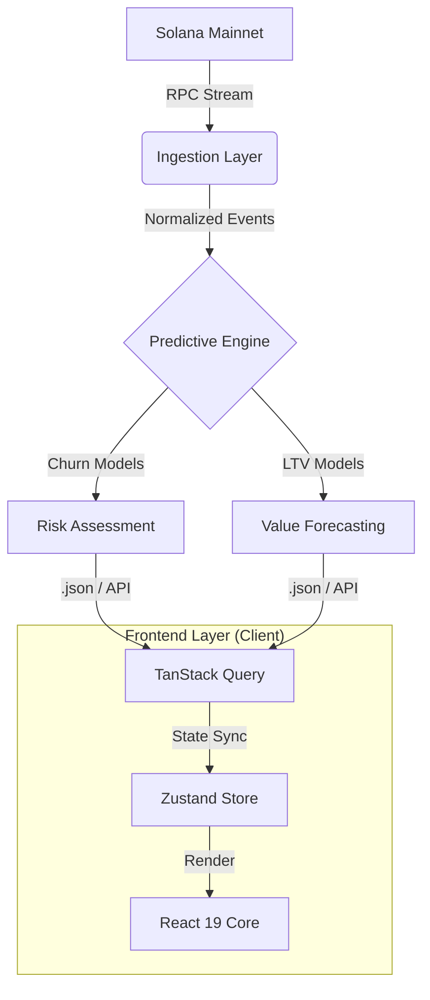

# 🔮 SOLANA GAME ANALYTICS: Nexus Dashboard

 
 
 


> **Next-Gen Player Behavior Modeling & Predictive Forecasting Engine.**

---

## ⚡ Mission Brief

**Solana Game Analytics (SGA)** is not just a dashboard—it is a **strategic intelligence command center**. 

In an ecosystem where on-chain data is fragmented, SGA aggregates, normalizes, and analyzes millions of data points to model gamer psychology. We answer the critical questions: *Who are the whales? When will they churn? What drives true retention?*

By fusing **real-time telemetry** with **predictive ML ensembles**, we empower developers to see the future of their game economies.

---

## 🏗️ System Architecture

The platform is built on a high-performance, event-driven architecture designed to handle the velocity of Solana's block times.



---

## 🧬 Engineering Excellence & Tech Stack

We prioritized **Type Safety**, **Render Performance**, and **Scalability**.

### **Core Framework**
-   **Frontend:** React 19 (Concurrent Mode enabled)
-   **Build Tool:** Vite 5 (HMR & Tree-shaking optimized)
-   **Language:** TypeScript (Strict Null Checks, 100% Type Coverage)

### **State & Data Layer**
-   **Global State:** `zustand` - Atomic state management minimizing re-renders.
-   **Server State:** `@tanstack/react-query` - SWR (Stale-While-Revalidate) caching strategies for instant UI feedback.
-   **Protocol:** Custom Hook Abstractions over standard REST/RPC endpoints.

### **Visualization Engine**
-   **Charting:** `recharts` & `@nivo` - Composable, SVG-based data visualization primitives.
-   **Physics:** `framer-motion` - GPU-accelerated layout transitions and micro-interactions.
-   **Styling:** `tailwindcss` + `tailwind-merge` + `clsx` - A robust, atomic design system.

---

## 📂 Frontend Structure

A fractal, feature-based architecture ensuring isolation of concerns and scalability.

```bash
solana-games-frontend/
├── public/                 # Static assets (Cyberpunk fonts, branding)
├── src/
│   ├── assets/             # Compiled media resources
│   │
│   ├── components/         # Atomic Component Library
│   │   ├── features/       # COMPLEX BUSINESS DOMAINS
│   │   │   ├── analytics/  # <GamerRetention>, <DailyActivity>, <CrossGame>
│   │   │   └── ml/         # <ChurnPrediction>, <ModelLeaderboard>, <Inference>
│   │   ├── layout/         # <Navigation>, <Footer>, <GlassContainer>
│   │   ├── providers/      # Context Wrappers (Theme, Wallet, QueryClient)
│   │   └── ui/             # PRIMITIVE UI KIT
│   │       ├── GlassCard.tsx       # Frosted glass morphism container
│   │       ├── NeonButton.tsx      # Polymorphic animated button
│   │       ├── Scanline.tsx        # CRT aesthetic overlay
│   │       └── Terminal.tsx        # Live log renderer
│   │
│   ├── hooks/              # Custom Logic Hooks
│   │   ├── useAutoRefresh.ts       # Polling synchronization engine
│   │   └── useTheme.ts             # System theme manager
│   │
│   ├── pages/              # Route Controllers
│   │   ├── LandingPage.tsx         # "Press Start" Experience
│   │   ├── DashboardPage.tsx       # Main Analytics Command Center
│   │   └── MLPage.tsx              # AI/ML Deep Dive & Calibration
│   │
│   ├── services/           # API Interface Layer
│   │   └── api.ts                  # Typed fetchers & error interceptors
│   │
│   ├── types/              # STRICT TYPE DEFINITIONS
│   │   └── api.ts                  # Shared Data Transfer Objects (DTOs)
│   │
│   └── utils/              # Pure Functions
│       └── formatters.ts           # Currency, Date, and Hash formatters
│
├── package.json            # Dependency manifest
├── tailwind.config.js      # Design Token System (Colors, Animations)
├── tsconfig.json           # Compiler Options
└── vite.config.ts          # Bundler Configuration
```

---

## 🧠 Advanced Capabilities

### **1. Cohort Retention Heatmaps**
We utilize a dynamic matrix algorithm to visualize user stickiness.
-   **Methodology:** Tracks unique wallet interactions across rolling 7-day windows.
-   **Optimization:** Memoized calculations ensure the heatmap renders instantly even with thousands of data points.

### **2. Ensemble Churn Prediction**
The "AI Predictions" module isn't just a static display.
-   **Risk Scoring:** Wallets are assigned a `0.0-1.0` probability score based on transaction velocity and recency.
-   **Safety:** Integrated `safeDate` parsing utilities ensuring cross-platform compatibility (iOS/Safari/Chrome) for timestamp analysis.

### **3. Live Ecosystem Telemetry**
-   **Real-Time Ticker:** A persistent websocket-style ticker aggregating events from the entire Solana gaming vertical.
-   **Performance:** Uses virtualized lists to handle high-frequency updates without DOM thrashing.

---

## 🚀 Deployment & CI/CD

The application is container-ready and optimized for Edge deployment.

1.  **Clone & Install**
    ```bash
    git clone https://github.com/your-username/solana-game-analytics.git
    npm ci
    ```

2.  **Environment Setup**
    ```bash
    cp .env.example .env
    # Configure VITE_API_ENDPOINT
    ```

3.  **Ignition**
    ```bash
    npm run dev
    # Access the mainframe at http://localhost:5173
    ```

---

## 🔮 Future Roadmap

-   [ ] **LLM Integration:** Natural language querying of blockchain data ("Show me all whales who played StepN yesterday").
-   [ ] **ZK-Proofs:** Private analytics for secure, anonymity-preserving gamer profiling.
-   [ ] **Mobile Native:** React Native port for iOS/Android telemetry.

---

*"Data is the new ammo. Load up."*

Copyright © 2025 Solana Game Analytics. All systems nominal.
